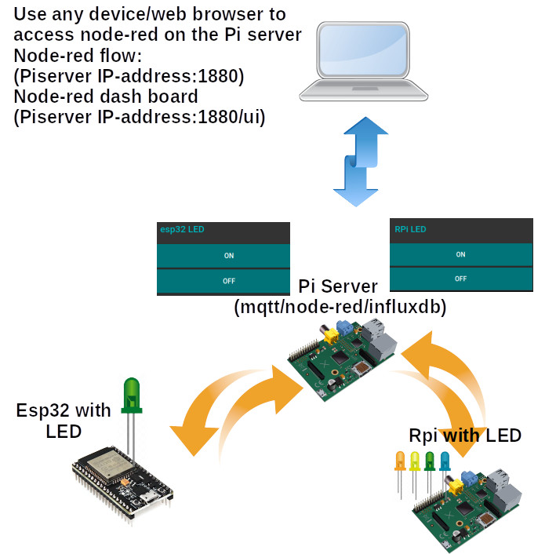
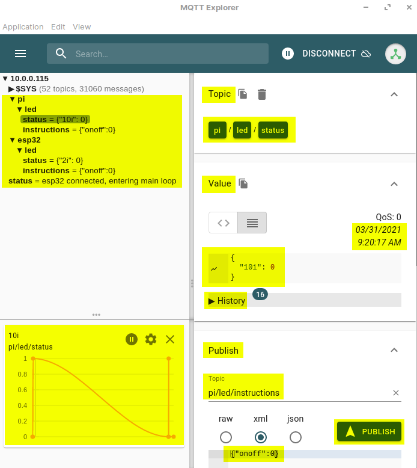

# [STEM Just 4 U Home Page](https://stemjust4u.com/)
# This project builds on P1-blink (multiple methods to turn an LED on/off with Raspberry Pi and ESP32.) by adding MQTT/node-red functions

This projects adds MQTT/node-red to send/receive data/instructions between devices. You will be able to turn the LED on from another device and see the status. The concept is useful for projects later on where you want to record temperatures or send instructions to a motor, servo, valve, etc. I will be using mosquitto mqtt for messaging between remote devices/clients (esp32/Pi) and a Pi acting as the broker running the mosquitto/node-red server.  

[Link to MQTT Project Web Site](https://stemjust4u.com/p1-Led-Blink-MQTT)  
[Link to initial LED Project](https://stemjust4u.com/p1-Led-Blink)
## Materials 
* LED (1.7-3V/20mA LED)
* Resistor (75-100ohm) - controls current going to LED
* Raspberry Pi and/or esp32 as remote mosquitto clients
* Raspberry Pi as mosquitto server (broker) and node-red server (note - the RPi being used to control an LED can also be used as the server. The mqtt client and server can be on the same Pi)

The esp32 (mosquitto client) will run micropython with umqttsimple to send the LED status and receive on/off instructions.

The RPi (mosquitto client) will run python with Paho to send the LED status and receive on/off instructions.

The Pi server (brooker) will have a mosquitto/node-red server running. Node-red will be used to display the LED status and to send on/off instructions. The Pi server will be the communication hub between the remote esp32/RPi and node-red.

To access the Pi server node-red configuration and LED status (dashboard) you use a web browser. (PiserverIPaddress:1880 and PiserverIPaddress:1880/ui)

>A quick check that your LED is working can be done by connecting it to the 3.3V pin on your Pi.

# Connecting the LED to Raspberry Pi
A great resource for Raspberry Pi pins is pinout.xyz. You can use a breadboard or connect the LED/resistor directly with jumper wires.
For my setup I used two LEDs and GPIO10 and 26. (along with GRND) Start with a single LED and get it working first.

# Connecting LED to esp32
On the ESP32 I used the internal LED (pin2). Although you could connect an external LED and just change the pin.  
You load the upython script on to the esp32 as /main.py  [Directions using Thonny](https://stemjust4u.com/esp32-esp8266)

# General Work Flow

[Follow this link for one-time setup of mosquitto/node-red servers](https://stemjust4u.com/mqtt-influxdb-nodered-grafana)  

## Mosquitto (mqtt) Clients - Python/uPython Code
>(1) To let your device connect to wifi and the mqtt server you need a section where you define the login information (wifi SSID/password and MQTT user/password). This is required for the client to be able to send/publish messages to the MQTT server/broker.  (if your RPi is already connected to the network the wifi SSID/password is not necessary)

>(2) Defining the MQTT callback functions - Depending on the use of the device multiple functions may be necessary to handle the mqtt communications. A **Connect function** is required to connect to the mqtt server(broker) and subscribe to topics for communication. Then a **Message function** is needed to monitor messages on the network from the broker. When a message topic matches the subscribed topic you can take action (turn on a switch, read a sensor, etc). If you want to send a status message or communicate back then a **Publish function** is needed to send/publish messages back to the broker. To make the messaging scaleable I use dictionaries in python and JSON for the mqtt message. An easy way to convert between the two is json.dumps/loads (or ujson.dumps/loads for uPython). For receiving messages the json.loads() is used to convert from JSON to python dictionary. For publishing messages the json.dumps() is used to convert back from python dictionary to JSON.

>(3) Bind MQTT functions, connect, and start the monitoring loop - This is where you bind the MQTT callback functions from step 2 to the mqtt client. Then you connect to the wifi/broker and start a loop for monitoring. There are multiple methods for the loop. **Loop Start/Stop** - will start a new thread that processes incoming/outgoing messages. You can continue executing code in a main loop if you want. **Loop Forever** - is a blocking function. Any action you want to take based on incoming messages will need to be in the Message function.

## Mosquitto (mqtt) Broker/Node-red Server
>MQTT server just needs to be running (no python code necessary)
Node-red Server - Setup nodes (can use JavaScript) for receiving mqtt messages (in JSON format) from the clients. Based on these messages can update the dashboard and write to an influxdb. Can also send messages back to the clients giving them instructions.

---

_Security - To avoid posting my wifi/mqtt broker info​ on github I put the user/password information in a local file (not loaded to github). I then read it into a list when the program runs. There are other methods you can research (ie using ENV variables) but this method is adequate for me and I can use it on both the esp32 and Rpi.(make sure your mosquitto.conf is set up with allow_anonymous set to false) When the devices log in the user/password is sent in clear text (not secure) but again is adequate for my project needs. There are more sequre methods using TLS/SSL Security or encrypting the payload if necessary._

---

### MQTT Explorer  
MQTT Explorer is a great tool for watching messages between your clients and broker. You can also manually enter a topic and send a msg to test your code. This is useful for first setting up your code and trouble shooting.

# Code
​​There are 3 sections
1. Single LED with RPi(Python) - /rpigpio/rpigpio-blinkMQTT.py
2. Multiple LED with RPi(Python) - /exampleMQTT.py (led module is imported from /rpigpio)
3. Single LED with esp32(uPython) - /upython (requires boot, main, and umqttsimple)

# Node Red
The node-red flow can be imported below. (and images of the flow are above). 
> mqtt in node is used to listen for messages from the clients (server: localhost:1883 and enter the topic)

> I use a JavaScript function to parse the incoming message. This allows me to have a generic script I use in any node-red setup. Code is in node-red folder. The JSON object is parsed and fields are created for each item. The msg topic is broken into a tag. An identifier is used on the end to indicate if the value was a float or integer ('f' vs 'i' is added to the end of the items in the python/upython code). 

# More Code (multi LEDs with a Class object)
LED class (object)

/exampleMQTT.py  
/rpigpio (packge/folder)  
|     |-- __init_.py  
|     |-- led.py (module)  

​​The rpigpio package (folder) contains a __init__.py and led.py module  
The led.py module can be executed standalone ($ python3 led.py) for testing.  
If you wanted to have this program start up at boot as a systemd service the logging function could be used for trouble shooting.  

The exampleMQTT.py script can be ran with  
`$ python3 exampleMQTT.py`  
Or an intial ON or OFF state can be passed (that is the sys.argv portion)  
`$ python3 exampleMQTT.py ON`

## Code Sections
1. MQTT functions defined (along with other functions required)
2. Logging/debugging control set with level
    * DEBUG (variables+status prints)
    * INFO (status prints)
    * CRITICAL (prints turned off)
3. Hardware Setup (set pins, create objects for external hardware)
4. MQTT setup (get server info align topics to match node-red)
    * SUBSCRIBE TOPIC
    * PUBLISH TOPIC
5. Start/bind MQTT functions
6. Enter main loop
    * Receive msg/instructions (subscribed) from node-red via mqtt broker/server
    * Perform actions
    * Publish status/instructions to node-red via mqtt broker/server