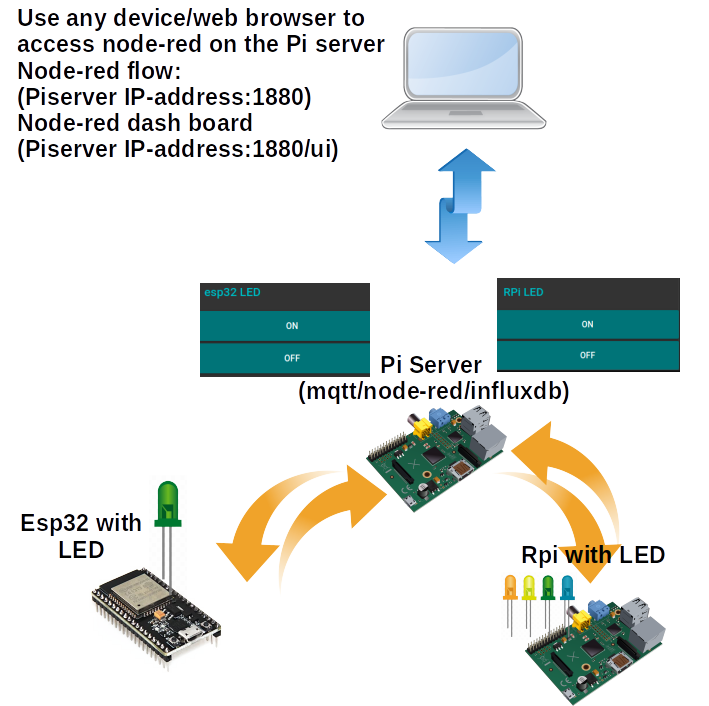
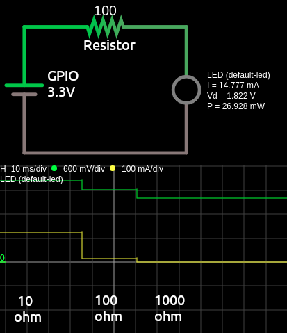

# [STEM Just 4 U Home Page](https://stemjust4u.com/)
# This project builds on P1-blink (multiple methods to turn an LED on/off with Raspberry Pi and ESP32.) by adding MQTT/node-red functions

[Link to MQTT Project Web Site](https://stemjust4u.com/p1-Led-Blink-MQTT)  
[Link to initial LED Project](https://stemjust4u.com/p1-Led-Blink)
## Materials 
* LED (1.7-3V/20mA LED)
* Resistor (75-100ohm) - controls current going to LED
* Raspberry Pi and/or esp32 as remote mosquitto clients
* Raspberry Pi as mosquitto server (broker) and node-red server (note - the RPi being used to control an LED can also be used as the server. The mqtt client and server can be on the same Pi)

This is a continuation of the LED blink project. Adding MQTT (will be using mosquitto) to practice communicating between remote devices/clients (esp32/Pi) and a server (broker) Pi running mosquitto/node-red.  (link to mqtt/node-red setup)

The esp32 (mosquitto client) will run micropython with umqttsimple to send the LED status and receive on/off instructions.

The RPi (mosquitto client) will run python with Paho to send the LED status and receive on/off instructions.

The Pi server will have a mosquitto/node-red server running. Node-red will be used to display the LED status and to send on/off instructions. The Pi server will be the communication hub between the remote esp32/RPi and node-red.

To access the Pi server node-red configuration and LED status (dashboard) you use a web browser. (PiserverIPaddress:1880 and PiserverIPaddress:1880/ui)

>A quick check that your LED is working can be done by connecting it to the 3.3V pin on your Pi.

# Connecting the LED to Raspberry Pi
A great resource for Raspberry Pi pins is pinout.xyz. You can use a breadboard or connect the LED/resistor directly with jumper wires.
For my setup I used two LEDs and GPIO10 and 26. (along with GRND) Start with a single LED and get it working first.

# Connecting LED to esp32
On the ESP32 I used the internal LED (pin2). Although you could connect an external LED and just change the pin.  
You load the upython script on to the esp32 as /main.py  [Directions using Thonny](https://stemjust4u.com/esp32-esp8266)

# Initial Code (single LED)
​​For initial LED blink code I tried out a couple Python libraries and even JavaScript. 
* RPi - Python with RPi.GPIO
* RPi - Python with gpiozero
* RPi - JavaScript
* esp32 - uPython

# If you want to practice some JavaScript (used for node-red) you will need node.js installed.
I followed the w3schools javascript tutorial  
Install onoff with  
`$ npm install onoff`  
Run your code with  
`$ node rpi-blink.js`

# More Code (multi LEDs with a Class object)
A simple script makes sense for blinking a single LED. But what if you wanted to connect 2,3,4 or more LEDs? And you are wanting to call it in other projects with just a couple lines of code. So the code needs to be organized and have a single object that holds all the LED information with functions (methods) that are easily called to turn all LEDs on or off. That is when the OOP (object oriented programming) comes in. Building an LED class (object) in its own module and making methods to turn them on/off is a good opportunity to practice OOP and create your own module.

Here is how I approached it  
/example.py  
|- rpigpio (packge/folder)  
|         |-- __init_.py  
|         |-- led.py (module)  

​​The rpigpio package (folder) contains a __init__.py and led.py module  
The led.py module can be executed standalone ($ python3 led.py) for testing.  
If you wanted to have this program start up at boot as a systemd service the logging function could be used for trouble shooting.  

The example.py script can be ran with  
`$ python3 example.py`  
Or an intial ON or OFF state can be passed (that is the sys.argv portion)  
`$ python3 example.py ON`